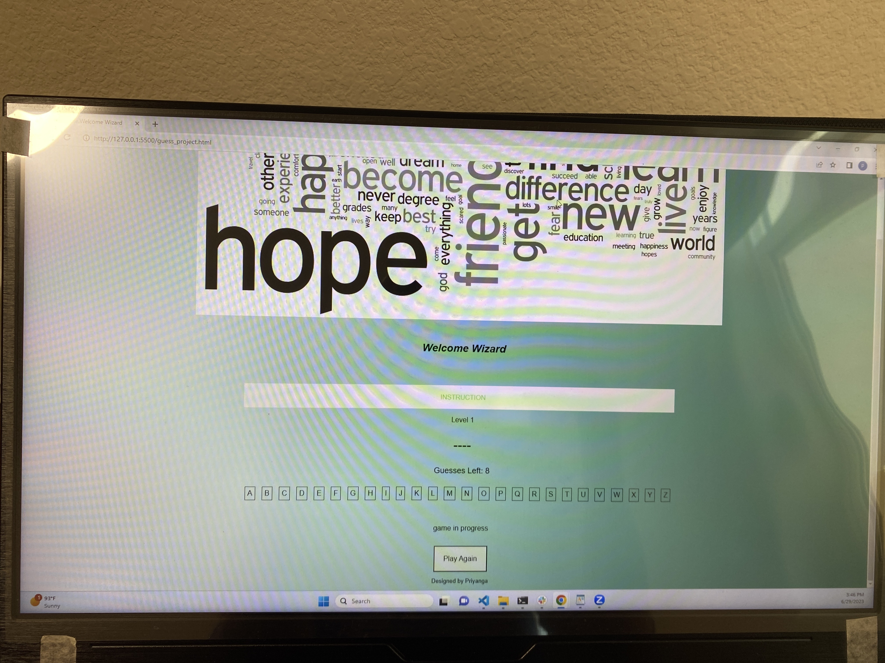

Game Title: Guess.Game.Welcome Wizard
Game Description:
It is a guess word game.The player has eight guesses to guess the word. The word can be from any place.The game consists of eight levels, with the length of the secret word increasing as the player progresses through each level.
The player starts at level one and is presented with a blank space representing the secret word.
An alphabet is provided for the player to select letters from.
When the player clicks on a letter from the provided alphabet, the game checks if the letter matches any of the letters in the secret word.
If the letter is correct, it is updated in the corresponding blank space(s) of the secret word.
If the letter is incorrect, the player's remaining guesses decrease by one.
The player has eight guesses to correctly guess the entire word.
If the player guesses all the letters within the allowed number of guesses, they win the level and proceed to the next level.
If the player exhausts all their guesses without guessing the word correctly, they lose the game.
At any point during the game, the player can choose to play again, which resets the game to level one.

Guess.Game.Welcome Wizard: Screenshot

Technology Used:
HTML
CSS
Javascript

Getting Started
click on the link to play the game
https://pas-priyanga.github.io/GUESS_GAME/

Next Steps:
To add animation effect.
To add feature to provide hints to each guess words.
To add skipping levels feature.